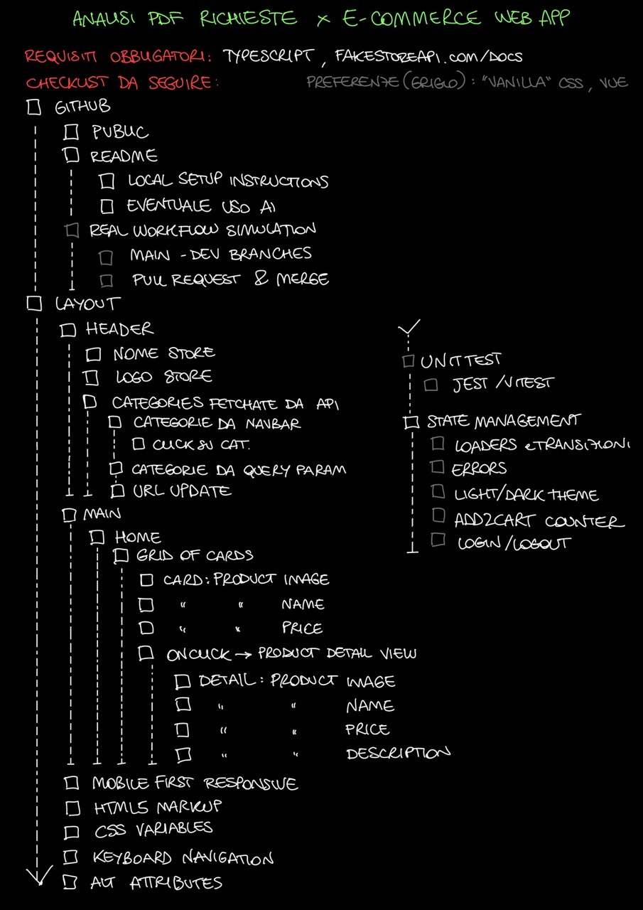
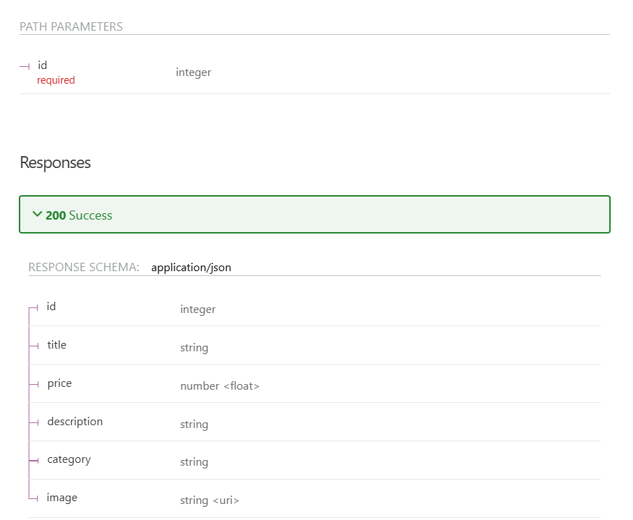
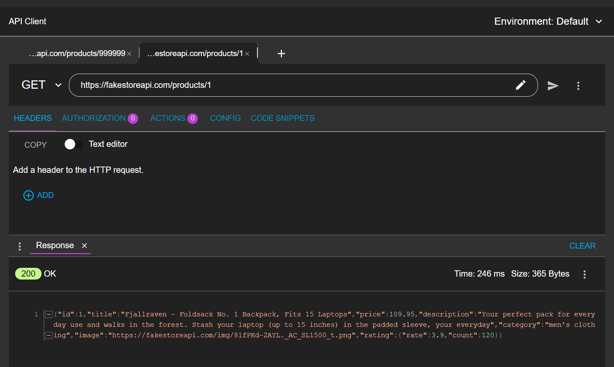
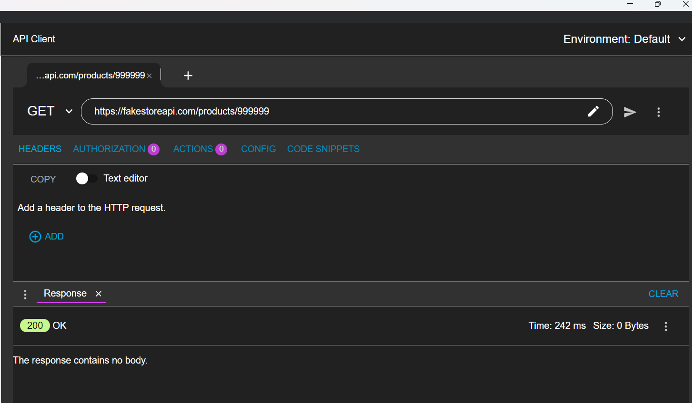
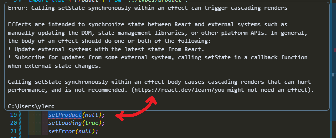
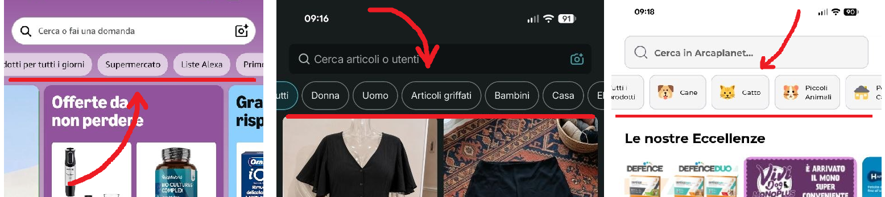
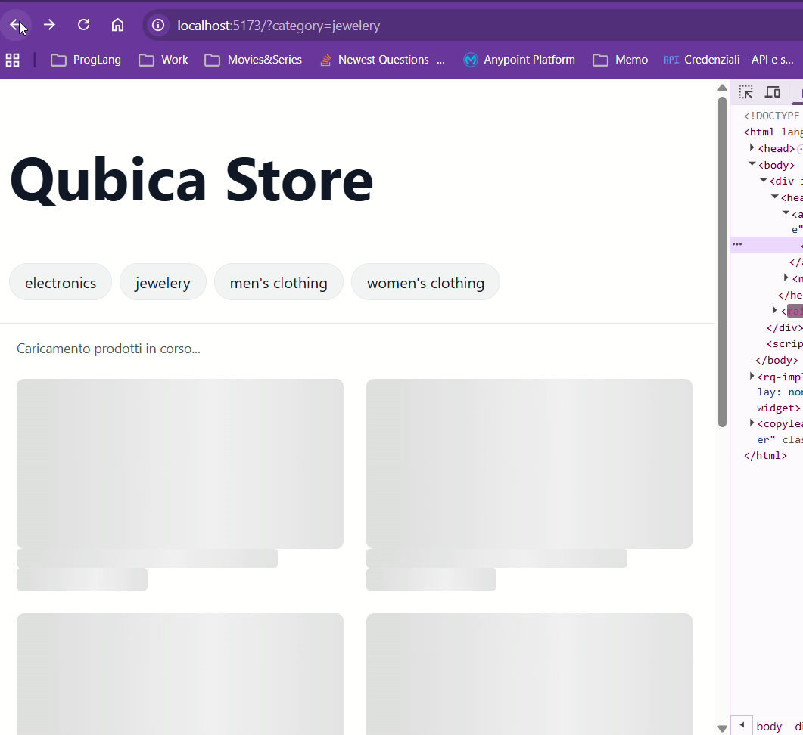
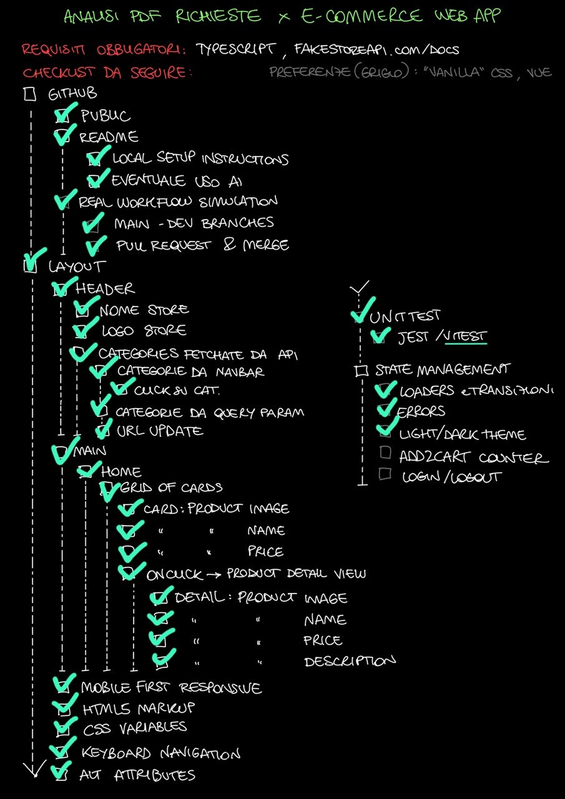

# Fake Store API E-commerce web app

ITA: Questo è un esercizio fatto come Junior Web engineer: una e-commerce web app in TypeScript che mostra i prodotti e le categorie prese da Fake Store API, con una visualizzazione del dettaglio prodotto e filtraggio delle categorie sincronizzate all'URL

ENG: This is a Junior Web Eng tech exercise:
a TypeScript e-commerce web app that lists products and categories from
Fake Store API
with a product detail view and category filtering sync to the URL

## Tech stack

- Vite + React + TypeScript
- react-router-dom
- CSS Modules + CSS custom properties (design tokens)
- Vitest (unit test)
- Fake Store API (https://fakestoreapi.com/docs) as backend

## Local setup

ITA: Prerequisiti: Node.js >= 20 (https://nodejs.org). Verifica con `node -v`
ENG: Prerequisites: Node.js >= 20 (https://nodejs.org). Check with `node -v`

```
git clone https://github.com/roxyle/ecommerce-qubica-store.git
cd qubica-store
npm install
npm run dev
```

ITA: L'app è disponibile su http://localhost:5173. Per eseguire gli unit test: `npm test`

ENG: The app runs at http://localhost:5173. To run unit tests: `npm test`

## AI usage disclosure and how I work

ITA: Questo progetto è stato sviluppato con l'assistenza di strumenti AI. Come Junior dev, quando si tratta di sviluppo, mi piace avere Claude come mio assistente senior. Durante la mia esperienza di 6 mesi in Engineering ho scoperto quanto sia prezioso per una junior come me avere un referente senior, e ho voluto cercare di replicare questa esperienza con Claude: non si tratta di sostituirsi a me e fare il mio lavoro, ma di avere uno sparring partner di supporto.

ENG: This project was developed with the assistance of AI tools.
As a Junior dev, when it comes to developing, I like having Claude to assist me as a senior dev.
During my 6-month internship at Engineering, I discovered how valuable a senior mentor can be to a junior like me, and I wanted to replicate that experience with Claude: it's not about replacing me and doing my own work, but about having a supporting sparring partner.

ITA: Quando il mio referente di Engineering mi assegnava un compito, iniziavamo quasi sempre da una analisi dei requisiti: dopo aver redatto una bozza iniziale, il mio referente la controllava e mi dava il via libera per iniziare. Ed è la stessa cosa che ho fatto con Claude in questo caso:

ENG: When my mentor at Engineering assigned me a task, we would almost always start with a requirements analysis:
after drafting an initial document on my own, my senior mentor would review it and give me the green light to proceed.
That is what I did with Claude:

1. ITA: Ho aperto il PDF e ho letto i requisiti.
ENG: I opened and read the PDF containing the requirements.

2. ITA: Ho redatto una bozza dei punti chiave.
ENG: I drafted a document outlining the key points.


3. ITA: Ho scaffoldato il progetto con React + Next.js (strumenti che sono abituata ad utilizzare).
ENG: I set up a project scaffold using React + Next.js (the tools I usually work with).

4. ITA: Ho chiesto a Claude di revisionare il mio documento e controllare se avessi dimenticato qualcosa.
ENG: I asked Claude to review my document and check if I had missed anything.

ITA: Col senno di poi, avrei dovuto invertire i passaggi 3 e 4. Dopo aver validato la mia checklist, Claude mi ha suggerito di usare Vite invece di Next.js dal momento che l'app che andremo a costruire è quasi interamente lato client, quindi avrei finito comunque per scrivere quasi tutto come Client Component ("use client") perdendo il vantaggio di Next che è quello di ridurre JS lato client con i Server Components, finendo anche per rischiare errori di hydration (il server dice una cosa, il browser ne dice un'altra e React non sa quale credere) o di suspense (React sta aspettando qualcosa, ma quel "qualcosa" non arriva nel modo giusto).

ENG: In hindsight, I should have swapped steps 3 and 4.
After validating my checklist, Claude advised me to use Vite instead of Next.js since the app I'm building is almost entirely client-side, I would have ended up marking almost everything with "use client", and this would defeat the main purpose of Next.js (which is reducing client-side JS through Server Components) also risking hydration errors (where the server says one thing, the browser says another, and React gets confused) or suspense issues (where React is waiting for something that doesn't arrive properly).

ITA: Normalmente, essendo ancora nella fase iniziale, avrei cancellato tutto e riniziato, ma ho preferito lasciare questo 'errore' per mostrare come mi comporto in queste situazioni.
Ho quindi rimosso folders e files generati da create-next-app@latest (che esegue anche un git init, fa un initial commit e crea un gitignore, che ho tenuto e modificato per adattarsi al nuovo progetto in Vite). Infine ho lanciato il comando npm create vite@latest .

ENG: Normally, being at such an early stage, I would have deleted everything and started fresh. However, I preferred to leave this 'mistake' visible to showcase how I handle these situations. Therefore, I removed the folders and files generated by create-next-app@latest (which also runs a git init, an initial commit and creates a .gitignore, which I kept and modified to fit the new Vite project). Then I ran npm create vite@latest .

ITA: Per alcune sezioni verbose del CSS ho delegato a Claude l'impostazione iniziale, verificandole poi una a una e chiedendo spiegazioni sulle proprietà che ancora non conoscevo (es. safe center per centrare elementi in contenitori con overflow-x mantenendo lo scroll raggiungibile).

ENG: For some verbose CSS sections I delegated the initial draft to Claude, then reviewed them one by one and asked for explanations about the properties I didn't know yet (e.g. safe center, to center items inside overflow-x containers while keeping the scroll reachable).

## Development log

ITA: Per poter scrivere il file types/product.ts mi serve sapere com'è strutturato il payload Json che arriverà da FakeStoreApi, vado quindi a vedere la documentazione riportata nel sito e imposto di conseguenza le coppie chiave:valore

ENG: Before writing the types/product.ts file, I need to know the structure of the JSON payload returned by the FakeStoreApi, so I checked the official documentation on their website and set up the key:value pairs accordingly


```
export type Product = {
    id: number;
    title: string;
    price: number;
    description: string;
    category: string;
    image: string

}
```

ITA: eseguita una chiamata GET (ho utilizzato ARC) per prodotto presente che restituisce risposta 200 ok e una chiamata GET per prodotto sicuramente non presente, per verificare il tipo di errore da gestire. Al contrario di quel che pensavo, ovvero che restituisse un errore 404 not found, l'API restituisce comunque status 200 ok però col body vuoto.

ENG: I performed a GET request (using ARC) for an existing product, which returned a 200 OK response, and another GET request for a non-existent product to check how errors are handled. Contrary to what I expected, which was a 404 Not Found error, the API still returns a 200 OK status, but with an empty body.
 

---

ITA: Arrivata alla fine del giorno 2, con la parte di dati/tipi/API completata ma senza ancora nessuna UI visibile, percepivo il progetto come "indietro" nonostante le fondamenta fossero solide. Ho chiesto a Claude di aiutarmi a suddividere il lavoro rimanente in sprint giornalieri, agganciati agli Acceptance Criteria, per avere uno stato di avanzamento concreto invece di una sensazione vaga di ritardo.

ENG: By the end of day 2, with the data/types/API layer done but no UI yet visible, I felt like the project was "behind" despite having solid foundations in place. I asked Claude to help me break the remaining work into daily sprints, tied to the Acceptance Criteria, so I'd have a concrete progress marker instead of a vague sense of falling behind.

---

ITA: Giorno 3. Completato lo Sprint 1: routing con react-router-dom, Header con categorie fetchate dinamicamente dall'API, Home con griglia prodotti e filtro per categoria sincronizzato con la query string dell'URL, pagina di dettaglio prodotto con stati distinti di caricamento/errore.

ENG: Day 3. Completed Sprint 1: routing with react-router-dom, Header with categories fetched dynamically from the API, Home with a product grid and category filter synced to the URL query string, product detail page with distinct loading/error states.

ITA: Nota tecnica interessante: React ha segnalato un warning (`react-hooks/set-state-in-effect`) sul reset manuale dello stato dentro un useEffect al cambio di un parametro. Ho chiesto a Claude di spiegarmelo, e la sua spiegazione rimandava alla documentazione ufficiale React sulla gestione dello stato nei componenti. L'ho verificata leggendo la pagina linkata. La soluzione (rimontare il componente tramite una key legata all'id, invece di resettare lo stato a mano) è quella consigliata dalla documentazione stessa.

ENG: An interesting technical note: React flagged a warning (`react-hooks/set-state-in-effect`) about manually resetting state inside a useEffect when a parameter changes. I asked Claude to explain it, and the explanation pointed to React's own official documentation on state handling, which I verified by reading the linked page myself. The fix (remounting the component via a key tied to the id, instead of manually resetting state) is the one recommended by the documentation itself.



---

ITA: Giorni 4-5. Costruito il design system su CSS custom properties (variables.css): palette verificata con calcoli di contrasto WCAG AA su entrambi i temi (chiaro/scuro), scala di spaziatura, tipografia e breakpoint documentati come riferimento unico per tutti i componenti. Durante la verifica sono emersi e sono stati corretti due problemi di contrasto reali (bottone in dark mode e outline di focus). Ripulito index.css dal boilerplate di Vite rimasto dallo scaffold, che applicava un tema scuro automatico in conflitto col design system. Stilizzati tutti i componenti con CSS Modules: griglia responsive auto-fill, skeleton loader con testo visibile per lo stato di caricamento, header con categorie a scorrimento orizzontale (prima di scegliere il pattern ho confrontato come Amazon, Vinted e Arcaplanet gestiscono la navigazione per categorie su mobile, e tutte convergono su una fila di pill scorrevoli), pagina dettaglio con layout colonna/riga su breakpoint 768px. Aggiunta utility formatPrice basata su Intl.NumberFormat per uniformare i prezzi. Layout verificato su smartphone e tablet fisici oltre che da DevTools.



ENG: Days 4-5. Built the design system on CSS custom properties (variables.css): palette verified with WCAG AA contrast calculations on both themes (light/dark), spacing scale, typography and breakpoints documented as the single reference for all components. The verification surfaced two real contrast issues (dark mode button and focus outline), both fixed. Cleaned index.css from leftover Vite scaffold boilerplate, which applied an automatic dark theme conflicting with the design system. Styled all components with CSS Modules: responsive auto-fill grid, skeleton loader with visible text for the loading state, header with horizontally scrollable categories (before picking the pattern I compared how Amazon, Vinted and Arcaplanet handle category navigation on mobile, and they all converge on a scrollable pill row, so I adopted the same approach), detail page with column/row layout on the 768px breakpoint. Added a formatPrice utility based on Intl.NumberFormat to keep prices consistent. Layout verified on physical smartphone and tablet as well as DevTools.



---

ITA: Giorno 5. Aggiunti unit test con Vitest sulla utility formatPrice (tre casi: prezzo decimale, intero, zero — incluso il non-breaking space che Intl.NumberFormat usa tra numero e simbolo, scoperto verificando l'output reale prima di scrivere gli attesi). Aggiunto testo visibile "Caricamento in corso" accanto agli skeleton, con aria-busy/aria-live: una scelta nata da un'esigenza personale di chiarezza rispetto alle sole animazioni, che si è rivelata essere una pratica di accessibilità raccomandata. Verificata la navigazione completa da tastiera (Tab, Shift+Tab, Invio) con focus sempre visibile; corretto il ritaglio dell'anello di focus dentro il contenitore a scroll delle pill (padding interno + margine negativo di compensazione).

ENG: Day 5. Added unit tests with Vitest on the formatPrice utility (three cases: decimal price, integer, zero — including the non-breaking space Intl.NumberFormat uses between number and symbol, discovered by checking the real output before writing the expected values). Added a visible "Loading" text next to the skeletons, with aria-busy/aria-live: a choice born from a personal need for clarity over animations alone, which turned out to be a recommended accessibility practice. Verified full keyboard navigation (Tab, Shift+Tab, Enter) with always-visible focus; fixed the focus ring clipping inside the pill scroll container (inner padding + compensating negative margin).

ITA: Ho attivato il tema dark/light: l'infrastruttura era già pronta (blocco [data-theme="dark"] in variables.css, contrasti già verificati al giorno 4), e infatti il collegamento ha richiesto solo uno state in App, un toggle nell'Header e una riga di useEffect che imposta l'attributo, nessuna modifica ai componenti, che usando i design token hanno reagito da soli.

ENG: I enabled the dark/light theme: the infrastructure was already in place ([data-theme="dark"] block in variables.css, contrasts verified on day 4), and indeed wiring it up only took a state in App, a toggle in the Header and one useEffect line setting the attribute, zero component changes, as they all react on their own through the design tokens.

ITA: Nota su Git: durante la chiusura di una sessione ho eseguito un amend su un commit già pushato (l'ordine corretto sarebbe stato amend prima, push dopo), creando una divergenza tra history locale e remota. Ho valutato due opzioni: scartare la riscrittura riallineandomi al remoto, o forzare l'aggiornamento del branch, e ho scelto un force push con --force-with-lease, la variante che rifiuta l'operazione se il remoto ha ricevuto push da altri nel frattempo: sicura in questo contesto (branch personale, nessun collaboratore). Lezione fissata: prima di ogni amend, verificare con git status che il commit non sia già stato pushato.

ENG: Git note: during a session wrap-up I amended an already-pushed commit (the correct order would have been amend first, push after), creating a divergence between local and remote history. I weighed two options: discarding the rewrite by resetting to the remote, or force-updating the branch, and chose a force push with --force-with-lease, the variant that refuses the operation if the remote received pushes from others in the meantime: safe in this context (personal branch, no collaborators). Lesson learned: before any amend, check with git status that the commit hasn't already been pushed.


## Checklist finale — dallo schema del giorno 1

ITA: Lo schema disegnato a mano a inizio progetto (vedi sopra), rivisitato a consegna con lo stato di ogni voce.
ENG: The hand-drawn outline from day 1 (see above), revisited at delivery with each item's status.

**Requisiti obbligatori / Mandatory:** TypeScript, fakestoreapi.com — done

- [x] **GITHUB**
  - [x] Public
  - [x] Readme
    - [x] Local setup instructions
    - [x] Eventuale uso AI / AI usage disclosure
  - [x] Real workflow simulation
    - [x] Main - dev branches
    - [x] Pull request & merge
- [x] **LAYOUT**
  - [x] Header
    - [x] Nome store
    - [x] Logo store
    - [x] Categories fetchate da API
      - [x] Categorie da navbar (click su cat.)
      - [x] Categorie da query param
      - [x] URL update
  - [x] Main
    - [x] Home
      - [x] Grid of cards (product image, name, price)
      - [x] Onclick -> product detail view (image, name, price, description)
  - [x] Mobile first responsive
  - [x] HTML5 markup
  - [x] CSS variables
  - [x] Keyboard navigation
  - [x] Alt attributes
- [x] Unit test (Vitest)
- [ ] State management *(parziale: stato sincronizzato via URL come single source of truth; nessuno store dedicato)*
  - [x] Loaders e transizioni (skeleton)
  - [x] Errors
  - [x] Light/dark theme
  - [ ] Add2cart counter
  - [ ] Login/logout